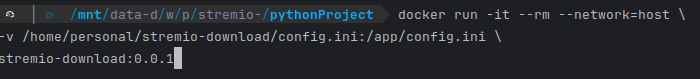
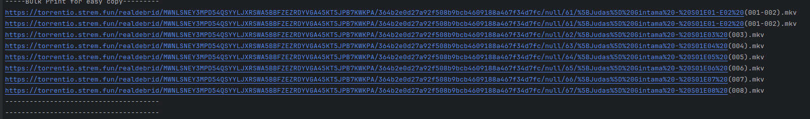
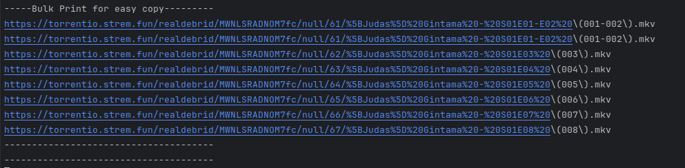

# Strenio-Download [Alpha]
[](https://github.com/sudhirnakka-dev/stremio-download/actions/workflows/docker-image.yml)

## Table of Contents
- [Introduction](#introduction)
- [Installation](#installation)
- [Usage](#usage)
- [Configuration](#configuration)
- [Contributing](#contributing)
- [License](#license)
- [Milestones](#milestones)
- [Contact](#contact)

## Introduction
This is a quickly put together python script which allows grabbing downloadable
url's from Stremio using your own account and preferences.

<a href="https://www.buymeacoffee.com/sudhirnakka-dev" target="_blank"></a>

## Why?
Even consuming content from Stremio, I prefer doing so behind a vpn to keep me and 
my network safe. Ofcourse, using vpn adds a layer of complexity:
* Lowers bandwidth speed a little
* Adds to the complexity of doing x things before being able to watch
* Problematic if I do want to watch on my other devices (TV) where I do not have vpn
* Want to offline store a content to be watched when there is no network!

## Solution:
Stremio already provides a easy way to download from a desktop browser. But this 
becomes a pain when am trying to prepare a playlist of content for offline use. (episodes, seasons, playlist).

This script automates grabbing these downloadable URL's from stremio.







```bash
# Clone the repository
git clone https://github.com/your-username/your-project-name.git

# Navigate to the project directory
cd your-project-name

# Install dependencies
pip install -r requirements.txt

# Dowcker build

```

## Usage
The script reads required parameters from environment variables, which simplifies configuring and executing it multiple times.

Multiple ways to run:
1. Python file directly
   2. After cloning the codebase, run npm install -r requirements.txt to install the required dependencies
   3. Modify the values in run.sh script and execute it
   ```bash
   ./run.sh 
   ```
2. Docker - locally
   1. Build a local docker image by using build-docker.sh script
   2. Modify values in run-docker.sh and execute it
   ```bash
   ./run-docker.sh
   ```


### Send to a Downloader
The above executions will fetch the downloadable links and will print them to console.
An additional step that can automate the flow would be to send these links to a downloader.

run_and_pipe.sh will give you an idea of what can be done. In the script, the downloadable links are sent
to metube url. The metube part can be replaced with any downloader - aria2, cloud downloaders etc..
```bash
./run_and_pipe.sh
```
 

### General flow within the script
The above will perform the following:
* It will login into stremio using your provided credentials (it all happens on your local machine)
* Navigates to the configured url, 
  * Detects the number of seasons available.
  * Navigates to season configured
  * Detects total episodes available
  * Grabs the downloadable url's and prints them out
  * If metube is configured, it will send the links to your metube
* Cleans up and closes down


## Contributing
The code is extremely initial dev level and is unclean. If you would still want to dig through:
Guidelines for how others can contribute to the project.

1. Fork the repository.
2. Create a new branch (`git checkout -b feature-branch`).
3. Make your changes.
4. Commit your changes (`git commit -m 'Add some feature'`).
5. Push to the branch (`git push origin feature-branch`).
6. Create a new Pull Request.


## Milestones:
I will be drafting additional milestones:
* Cleanup
* Make it robust enough to handle edge cases.
* Add a UI layer - to paste a url in UI, select options - trigger. Instead of CLI
* Integrate this sript, UI and metube into a single docker image
  * Run a single image, perform operations, destroy it.
* Add persistance
  * Track shows being downloaded and episodes yet to grab for future
* Integrate traktv
  * Get your lists from traktv


## Thank you
If you think the above helps or if the above milestones are worth working on for the community, please do think about donating to support

<a href="https://www.buymeacoffee.com/sudhirnakka" target="_blank"></a>

## License
MIT License.

## Contact
Contact information for the project maintainers.
- **Maintainer Name** (dragonborn@sudhirnakka.com)
